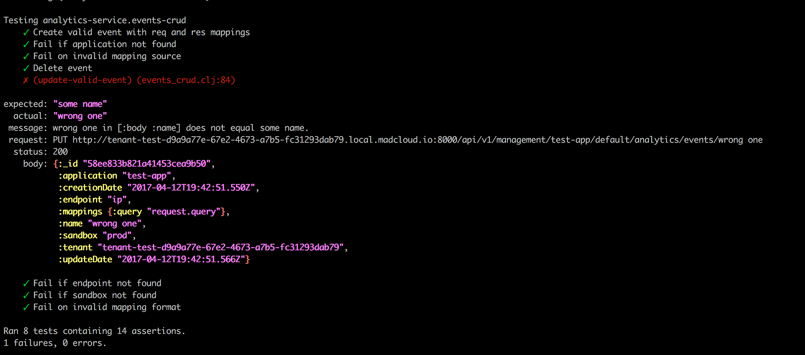

# restpect

Restpect is a small Clojure library that provides a set of functions to write succint and readable
integration tests over RESTful APIs.

```clojure
(require '[restpect.core :refer [created ok not-found]]
         '[restpect.json :refer [GET PUT DELETE]]
         '[clojure.test :refer [deftest]])

(deftest create-get-and-delete-user
  ;; expect 201 status response and body containing a :user-id integer
  (created
   (PUT "http://example.com/api/v1/users/john" {:email "john@example.com"})
   {:user-id integer?})

  ;; expect 200 status and body containing :user-id and :email
  (ok
   (GET "http://example.com/api/v1/users/john")
   {:user-id integer?
    :email   "john@example.com"})

  ;; expect the response body to be a collection that contains at least one
  ;; element that has a :user-id integer and the given :email
  (ok
   (GET "http://example.com/api/v1/users/")
   #{{:user-id integer?
      :email   "john@example.com"}})

  (ok (DELETE "http://example.com/api/v1/users/john"))

  ;; expect 404 status and a body with a :message string that contains "not found"
  (not-found
   (GET "http://example.com/api/v1/users/john")
   {:message #"not found"}))
```

## Installation

Add the following to your project `:dependencies`:

```clojure
[restpect "0.2.1"]
```

## Reference
### Request helpers
The `restpect.json` namespace provides wrappers around the [clj-http](https://github.com/dakrone/clj-http)
request functions with sane defaults for JSON API requests (coerce request and
response as JSON, don't throw exceptions on 4xx and 5xx responses, etc.).

All these functions have the following signature:

``` clojure
(POST url)
(POST url body)
(POST url body extras)
```

The `body` is passed to clj-http as the `:form-params` for `POST`, `PUT`, `PATCH`
and `DELETE`, and as the `:query-params` for `GET`, `HEAD` and `OPTIONS`.

`extras` is a map of overrides passed to the clj-http call.

### Assertion functions

#### expect
The main assertion function is `restpect.core/expect`:

``` clojure
(expect response spec)
```

The first argument (usually a clj-http response map, although it can be
any value), will be compared against the given spec with the following criteria:

* For maps, compare the value of each key in the spec with the value at the same key
of the response, using `expect` recursively.
* For sets, check that each element in the spec matches some element in the response,
comparing with `expect` recursively. This is useful to look for an element somewhere
in a list, regardless of the position.
* For other collections, compare each element in the spec with the same element at the
same position in the response, using `expect` recursively.
* For functions, pass the value in the response to the spec function expecting a
truthy result.
* For Regular expressions match the spec with the actual value (using [re-find](https://clojuredocs.org/clojure.core/re-find)).
* For the rest of the values, expect the spec and the response values to be equal.

Example:

``` clojure
(expect (GET url)
        {:status 404
         :body   [{:result  nil?
                   :code    125
                   :message #"not found"}]})
```

This assertion is equivalent to the following:

``` clojure
(let [res (GET url)]
  (is (= 404 (:status res)))
  (is (nil? (get-in res [:body 0 :result])))
  (is (= 125 (get-in res [:body 0 :code])))
  (is (re-find #"not found" (get-in res [:body 0 :message]))))
```

As seen in the example, `expect` is opinionated in the sense that it makes it
simple to test for values and conditions on specific fields of the reponses
rather than doing an exact comparison of the payloads.

#### Status shorthands
`restpect.core` also provides a set of wrappers around `expect` with the
names of the different HTTP response status codes: `ok`, `created`, `bad-request`,
`not-found`, etc.

These helpers implicitly validate the `:status` value of the given response map,
and can optionally take a second argument that will be compared against the
response body.

Using status shorthands, the example from the previous section becomes:

``` clojure
(not-found (GET url)
           [{:result  nil?
             :code    125
             :message #"not found"}])
```

Another example:

``` clojure
(deftest create-and-delete-user
  (created (PUT "http://example.com/api/v1/users/john" {:email "john@example.com"}))
  (ok (GET "http://example.com/api/v1/users/john"))
  (ok (DELETE "http://example.com/api/v1/users/john"))
  (not-found (GET "http://example.com/api/v1/users/john")))
```

### Test reporter

Restpect also provides a custom test reporter that adds request and response
information to failure messages (provided by `expect`) and does some formatting:



The report multimethod can be found in `restpect.report/report` and can be used
with plugins that allow to override the test reporter, like
[eftest](https://github.com/weavejester/eftest)
and [lein-test-refresh](https://github.com/jakemcc/lein-test-refresh):

``` clojure
;; project.clj
:eftest {:report restpect.report/report}
:test-refresh {:report restpect.report/report}
```

If you already work with a custom reporter and just want to add some
request/reponse data to its output, consider adding a defmethod for
`:type :response`, for example:

``` clojure
(require '[restpect.report :refer [print-response]]
         '[eftest.report.progress :as eftest]
         '[clojure.test :refer [with-test-out]])

(defmulti report :type)
(defmethod report :default [m] (eftest/report m))
(defmethod report :response [m]
  (with-test-out
    (println "\r" (repeat 80 " ") "\033[F" "\033[F")
    (print-response (:response m))))
```
